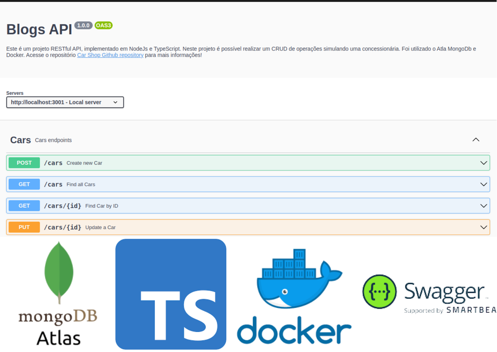
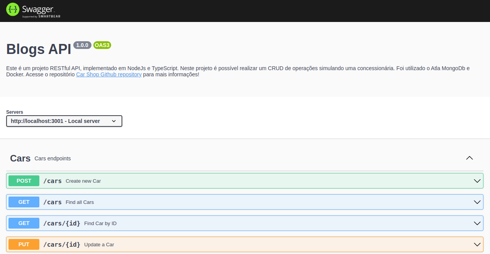
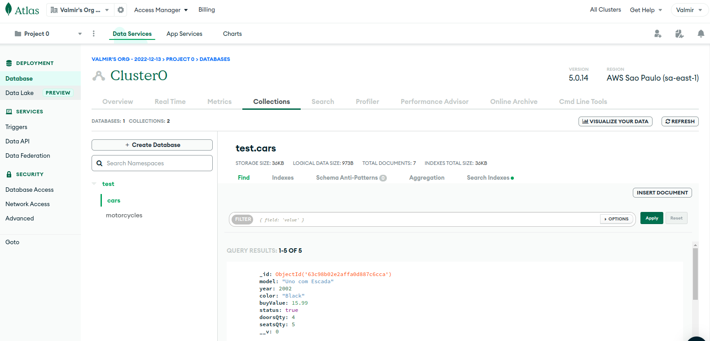

# 🚗 🛵 Car Shop MongoDB



<br />

## 📡 Sobre
#

Este é um projeto RESTful API, implementado em NodeJs e TypeScript. Neste projeto é possível realizar um CRUD de operações simulando uma concessionária. Foi utilizado o Atla MongoDb e Docker.. Realizado durante meus estudos na <a href="https://betrybe.com/" target="_blank">Trybe</a>, neste projeto é possível realizar um CRUD de operações.

<br />

## 🚀 Instalação e execução
#

<details>
<summary>Instalando e executando com Docker</summary>
<br />

Para rodar está aplicação é necessário ter **Git**, **Docker** e o **Docker Compose** instalados no seu computador. O Docker Compose precisa estar na versão **1.29** ou superior.

### 1 - Clone o repositório:

```
git clone git@github.com:vschagas/Car_Shop_MongoDB_POO.git
```

### 2 - Na raíz do projeto, suba o container  `car_shop_mongodb_poo` utilizando o docker-compose.

    docker-compose up -d

### 3 - Abra o terminal do container `blogs_api`.

    docker exec -it blogs_api bash

### 4 - No terminal do container, instale as dependências com o comando:

    npm install

### 6 - Agora execute a aplicação com o comando:

    npm run dev

</details>
<br />

## 📚 Documentação
#

Acesse a rota http://localhost:3001/api-docs para acessar a documentação e testar a API. Se preferir, utilize um cliente de requisições HTTP de sua preferência (Insomnia, Thunder Client, etc) para fazer as requisições.

<br />



<br />

## 💾 Banco de Dados
#

Para este projeto foi utilizado configuração e utilização do banco de dados em nuvem <a href="https://www.mongodb.com/pt-br/cloud/atlas/efficiency" target="_blank">ATLAS</a> da MongoDB

<br />



<br />

## 🛠️ Tecnologias
#

- TypeScript
- POO
- Express.js
- Node.js
- Docker
- Mongoose
- MongoDb
- Mocha.js
- Chai.js
- Sinon.js
- Swagger

<!-- # -->

<!-- ## 🧪 Cobertura de testes


# -->

